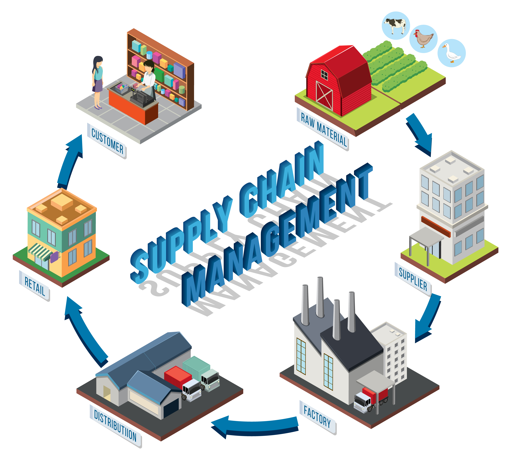

# 🚀 Man-Power Supply Chain Management

<div align="center">
  
  <br/>
  <strong>A modern, responsive landing page for supply chain management solutions</strong>
  <br/><br/>
  🌐 <a href="https://rk-rohiit.github.io/Man-Power-Supply/">Live Demo</a> | 📺 <a href="https://www.youtube.com/@BrainCoder">YouTube Channel</a> | 📝 <a href="#-installation">Documentation</a>
</div>

---

## 📋 Table of Contents

- [About The Project](#-about-the-project)
- [Features](#-features)
- [Technologies Used](#-technologies-used)
- [Live Demo](#-live-demo)
- [Screenshots](#-screenshots)
- [Installation](#-installation)
- [Usage](#-usage)
- [Project Structure](#-project-structure)
- [Contributing](#-contributing)
- [License](#-license)
- [Contact](#-contact)

---

## 🎯 About The Project

**Man-Power Supply** is a professional landing page designed for **supply chain management companies**.  
This project showcases a **modern, responsive web design** with smooth animations, interactive elements, and a clean user interface.

✨ **Key Highlights**

- 📱 Fully Responsive Design (Mobile, Tablet, Desktop)
- 🎨 Modern Red, Black & White Theme
- ⚡ Fast Loading with Smooth Animations
- 🖱️ Interactive UI Elements
- 📧 Contact Form Integration
- 👥 Team Member Showcase
- 📊 Statistics Counter Section

---

## 🌟 Features

### Core Features

- **Hero Section** – Eye-catching gradient background with CTA buttons
- **About Us** – Company information with engaging visuals
- **Services/Stats** – Interactive statistics cards with hover effects
- **Team Members** – Professional showcase grid
- **Contact Form** – Functional form with validation
- **Responsive Navigation** – Mobile-friendly hamburger menu
- **Smooth Scrolling** – Enhanced UX
- **Modal Popups** – Clean modal design
- **Footer** – With social media links

### Technical Features

- ✅ Pure **HTML5, CSS3, and Vanilla JavaScript** (No frameworks)
- ✅ **CSS Grid & Flexbox** for layouts
- ✅ **CSS Custom Properties (Variables)**
- ✅ Mobile-First Approach
- ✅ Cross-Browser Compatible
- ✅ SEO & Performance Optimized

---

## 🛠️ Technologies Used

- **Frontend:** HTML5, CSS3, JavaScript
- **Libraries & Tools:**
  - [Font Awesome 6.0](https://fontawesome.com) – Icons
  - [Google Fonts (Inter)](https://fonts.google.com/) – Typography
  - CSS Grid & Flexbox – Layout
  - CSS Animations – Smooth transitions

---

## 🌐 Live Demo

👉 [Visit Live Website](https://rk-rohiit.github.io/Man-Power-Supply/)

---

## 📸 Screenshots

### Desktop View


### Mobile View


---

## 🚀 Installation

### Prerequisites

- A modern web browser (Chrome, Firefox, Safari, Edge)
- Text editor (VS Code, Sublime, etc.)
- Basic knowledge of HTML, CSS, JS

### Steps

```bash
# Clone the repository
git clone https://github.com/rk-rohiit/Man-Power-Supply.git

# Navigate to project directory
cd Man-Power-Supply

# Open in browser
# Simply open index.html in your browser
```
